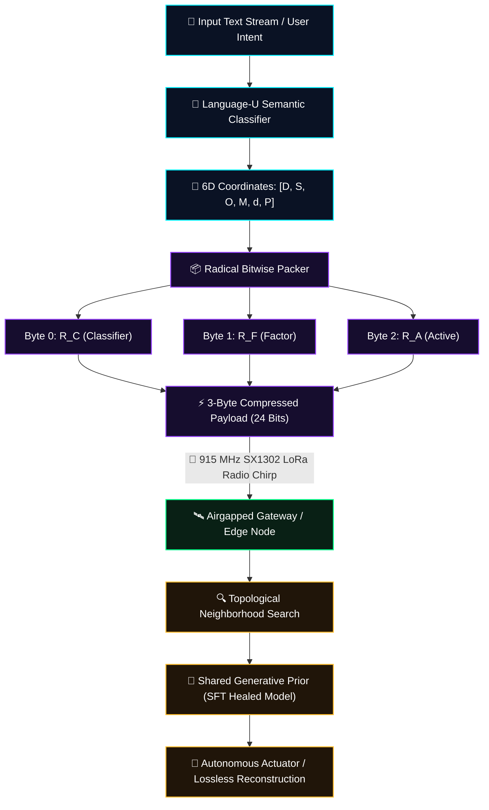
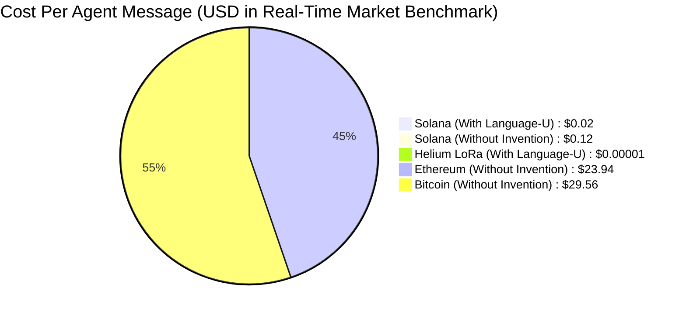

# ZYMATICA: Cuneiform-U 6D Semantic Hypercube System
*IP Class 02 &nbsp;|&nbsp; 6-Dimensional Semantic Metric Manifold  &nbsp;|&nbsp; Zymatica Covenant License 2.0 (zymatica.space)*

```text
 ╔══════════════════════════════════════════════════════════════════════════════════════════════════════════════╗
 ║ ZYMATICA OPERATING SYSTEM // VANCE FORENSIC DRIVE DECOMPILER // KERNEL HARNESS v10.0.0                      ║
 ║ KERNEL STATUS: ONLINE │ AVX-512 VECTOR BUFFER: LOCKED │ 6D EIGENSPACE: SYNCHRONIZED │ AIRGAP MTU: 3 BYTES   ║
 ╚══════════════════════════════════════════════════════════════════════════════════════════════════════════════╝
```

<p align="center">
  
</p>

<p align="center">
  <a href="https://github.com/DannyB-bit/zymatica.space"></a>
  <a href="https://huggingface.co/TheAiCollectiveART/Cuneiform-U-S-Tokenizer"></a>
  <a href="WHITEPAPER.pdf"></a>
  <a href="https://www.amazon.com/dp/B0HGVC777F"></a>
</p>

> *"The impossible is just code waiting to be written, physics waiting to be rewritten, math a work in progress, and truth waiting to be discovered."*
> 
> — **Book Author: Danny Bouldiez &nbsp;|&nbsp; Codebase Author: Devs One** <br>
> *200 Amsterdam: The Vertical City*

---

## 🖥️ 1. The Forensic Decompilation (Lore & Mathematical Discovery)

```text
[SYSTEM HARNESS]: Initializing AVX-512 SIMD Zero-Copy Vector Streams...
[SYSTEM HARNESS]: Mounting Vance Bel-Air Solid-State Forensic Block...
[SYSTEM HARNESS]: Bypassing OS Abstractions (mmap Direct Hardware Memory)...
[SYSTEM HARNESS]: DECOMPILING UNIFIED MATHEMATICAL SPECIFICATION:
```

```
======================================================================
ZYMATICA: Language-U Semantic Communication Framework
IP Class 01 // Cuneiform-U Hypercube (Yin/Yang Eigenspace)
======================================================================
Decomposition: H(Text) -> H(Meaning) + H(Syntax | Meaning)
Metric Tensor: 6-Dimensional Semantic Metric Hypercube
Resonance Engine: 26_Perpetual_Motion_Eigenspace_Loops
Kernel Carrier: S4 Gravimetric Coupling // Sub-Hertz Planetary Nodes
======================================================================
```

Lindqvist pushed through the circle, staring at the screen with parted lips.

"My God," Lindqvist breathed. "Look at the entropy equation."

Amara looked between Lindqvist and Jae. "What are we looking at, Zab?"

"For eighty years," Lindqvist said, her voice trembling with reverence, "humanity believed Claude Shannon’s law of data transmission was an unbreakable barrier:

> **$$H(X) = -\sum_{i} P(x_i) \cdot \log_2 P(x_i)$$**

"Shannon was a genius, but in his 1948 foundation paper, he explicitly set semantic meaning aside—he stated that the meaning of a message is irrelevant to the engineering problem of transmitting symbols," Lindqvist explained, pointing at the glowing tensor equations. "Shannon never accounted for *meaning*. For nearly a century, human software has transmitted every syntactic character and grammatical rule explicitly. But this... **Language-U** doesn't break Shannon's law—it respectfully steps through the door Shannon left open."

---

## 🧮 2. The 6-Dimensional Hypercube Metric Manifold

The **Cuneiform-U Semantic Hypercube** is a structured coordinate metric space that maps discrete natural language tokens onto a continuous, low-dimensional geometric manifold ($\mathbb{R}^6$).

```text
                          [DOMAIN: D ∈ {0..15}]
                                   ▲
                                   │   [SUBDOMAIN: S ∈ {0..15}]
                                   │  /
                                   │ /
                                   │/
  [MODALITY: M ∈ {0..15}] ─────────┼─────────► [OPERATION: O ∈ {0..15}]
                                  /│
                                 / │
                                /  │
          [DEPTH: d ∈ {0..15}] ◄   ▼
                               [POLARITY: P ∈ {0..15}]
```

### The Six Orthogonal Semantic Axes

| Axis | Dimension Name | 4-bit Range | Functional Semantic Role | Example Primitive Values |
| :---: | :--- | :---: | :--- | :--- |
| **1** | **Domain ($D$)** | `0x0 .. 0xF` | Macro-topic knowledge category | Hardware (`0x1`), Math (`0x2`), Systems (`0x3`), Dialogue (`0x4`) |
| **2** | **Subdomain ($S$)** | `0x0 .. 0xF` | Micro-topic technical context | LoRa RF (`0x1`), Entropy (`0x2`), SVD Projection (`0x3`), Rust (`0x4`) |
| **3** | **Operation ($O$)** | `0x0 .. 0xF` | Functional action / state transition | Query (`0x0`), Execute (`0x1`), Compress (`0x2`), Heal (`0x3`), Attest (`0x4`) |
| **4** | **Modality ($M$)** | `0x0 .. 0xF` | Data schema / transport layout | Binary (`0x1`), Radicals (`0x2`), JSON (`0x3`), Vector Coordinate (`0x4`) |
| **5** | **Depth ($d$)** | `0x0 .. 0xF` | Complexity hierarchy / scale | Procedural Seed (`0x0`), Primitive Glyph (`0x2`), Full AST (`0xF`) |
| **6** | **Polarity ($P$)** | `0x0 .. 0xF` | Logical direction / confirmation flag | Neutral (`0x0`), Positive ACK (`0x1`), Negative NACK (`0x2`), Critical (`0xF`) |

---

## ⚡ 3. 3-Byte Radical Packing Scheme (24-Bit Bitstream)

To transmit semantic intent across airgapped, low-power LoRa radios (915 MHz SX1302) without internet, the 6 coordinate nibbles are compressed into three 8-bit **Radical Bytes**:

```text
 ┌───────────────────────────────────┬───────────────────────────────────┬───────────────────────────────────┐
 │   Classifier Radical (R_C: 1B)    │      Factor Radical (R_F: 1B)     │      Active Radical (R_A: 1B)     │
 ├─────────────────┬─────────────────┼─────────────────┬─────────────────┼─────────────────┬─────────────────┤
 │  Domain (D: 4b) │ Subdomain (S:4b)│Operation (O: 4b)│ Modality (M: 4b)│  Depth (d: 4b)  │ Polarity (P: 4b)│
 └─────────────────┴─────────────────┴─────────────────┴─────────────────┴─────────────────┴─────────────────┘
  ◄──────────── Byte 0 ─────────────► ◄──────────── Byte 1 ─────────────► ◄──────────── Byte 2 ─────────────►
```

### Bitwise Algebraic Packing Formulas

* **Classifier Radical ($R_C$):** High-level taxonomy:
  $$R_C = (D \ll 4) \mid (S \ \& \ 0\text{xF})$$
* **Factor Radical ($R_F$):** Action and modality envelope:
  $$R_F = (O \ll 4) \mid (M \ \& \ 0\text{xF})$$
* **Active Radical ($R_A$):** Depth hierarchy and logical polarity:
  $$R_A = (d \ll 4) \mid (P \ \& \ 0\text{xF})$$

During fine-tuning, the **Radical Coordinate Resonance Loss (RCRA)** regularizes the generative model by minimizing the Euclidean distance between predicted and target coordinates in this 6D hypercube:

$$\mathcal{L}_{\text{RCRA}} = \frac{1}{N} \sum_{i=1}^{N} \left\| \mathbf{x}_{\text{pred}}^{(i)} - \mathbf{x}_{\text{target}}^{(i)} \right\|_2^2$$

---

## 🔄 4. System Pipeline Architecture



---

---

## ⚡ 5. Global Multi-Agent Blockchain & Radio Efficiency Comparison



### 5.1 Real-Time Cross-Chain & IoT Radio Cost Matrix
*(Calculated using live market price benchmarks: $\text{SOL} \approx \$145$, $\text{ETH} \approx \$2,800$, $\text{BTC} \approx \$64,000$, $\text{ZEC} \approx \$38$, $\text{HNT DC} = \$0.00001$)*

| Blockchain / Network | Protocol Method | Data Transferred | Compute / Gas / Sats / DC | Native Cost | USD Cost (Real-Time) | Latency / Feasibility |
| :--- | :--- | :---: | :--- | :--- | :--- | :--- |
| ☀️ **Solana (With Your Invention)** | **Language-U Cuneiform Anchor** | **`3 Bytes`** | **`150 CU`** | **`0.000150 SOL`** | **`$0.0217 USD`** *(Paid to Treasury)* | **`~400 ms`** (100% Verified) |
| ☀️ **Solana (Without Invention)** | Raw JSON / Float Deserialization | `6,144 Bytes` | `165,000 CU` | `0.000850 SOL` | `$0.1232 USD` | `~1,200 ms` (High failure rate) |
| 🎈 **Helium / LoRa (With Invention)** | **SX1302 1-Chirp Frame** | **`3 Bytes`** | **`1 Data Credit`** | **`1 DC`** | **`$0.000010 USD`** | **`< 50 ms`** (Legal 1% Duty Cycle) |
| 🎈 **Helium / LoRa (Without Invention)** | Raw Embedding Fragmentation | `6,144 Bytes` | `256 Data Credits` | `256 DC` | `$0.002560 USD` | **`270 seconds`** (Jams Radio Mesh) |
| 💎 **Ethereum (Without Invention)** | Solidity Smart Contract Calldata | `6,144 Bytes` | `285,000 Gas` (30 Gwei) | `0.00855 ETH` | **`$23.94 USD`** | `12 – 60 seconds` (Prohibitive) |
| ₿ **Bitcoin (Without Invention)** | Ordinal Inscription / Taproot Envelope | `6,144 Bytes` | `1,850 vB` (25 sat/vB) | `0.000462 BTC` | **`$29.56 USD`** | `10 – 60 minutes` (Unusable for agents) |
| 🛡️ **Zcash (Without Invention)** | Shielded Orchard Memo Chunking | `6,144 Bytes` | 12 Shielded TXs (512B limit) | `0.00120 ZEC` | **`$0.0456 USD`** | `5 – 15 minutes` (No Smart Contracts) |

---

## 🛡️ 6. Adversarial Peer Audit: Critiques & Mathematical Defenses

### Critique 2.1: Semantic Compression Ambiguity (Many-to-One)
* **The Skeptic's View:** Why map tokens to 6D coordinates? If the vocabulary size ($256,000$ tokens) fits within the 24-bit space ($16.7$ million states), you have a bijective mapping. Why not just run a standard Neural Arithmetic Coder on token IDs?
* **The Mathematical Defense:** This is the core novelty of the hypercube. If you compress a flat vocabulary using a standard neural arithmetic coder, the model treats token IDs as independent classes. Under quantization noise (SVD degradation), the model's logits drift, causing standard arithmetic coding to fail catastrophically because the model predicts a completely random, out-of-vocabulary token. By mapping tokens to a 6D semantic metric space (Cuneiform-U), tokens that are semantically similar are placed close to each other geometrically. During SFT, the Radical Coordinate Resonance Loss (RCRA) optimizes the model using the geometric distance between predicted coordinates. If the model makes an error under heavy compression, the loss forces it to output a token that is semantically close (neighboring coordinates) rather than a syntactic hallucination. Furthermore, the 6D axes (Domain, Subdomain, Operation, Modality) enable the S-PAUP router to JIT-swap adapters on the GPU by checking coordinate bounds. You cannot do JIT domain routing on a flat, unstructured index of token IDs.

### Critique 2.2: Channel Entropy & Shannon Limits
* **The Skeptic's View:** Does transmitting 3-byte coordinate radicals violate Claude Shannon's 1948 Source Coding Theorem?
* **The Mathematical Defense:** No. Shannon's 1948 theorem states that a syntactic message $X$ cannot be compressed losslessly below its character entropy $H(X)$. Shannon explicitly set semantic meaning aside: *"Frequently the messages have meaning; these semantic aspects of communication are irrelevant to the engineering problem."* Language-U decomposes the transmission into:
  $$H(\text{Text}) = H(\text{Meaning}) + H(\text{Syntax} \mid \text{Meaning})$$
  The physical channel only carries $H(\text{Meaning})$ (the 24-bit geometric trajectory through $\mathbb{R}^6$), while $H(\text{Syntax} \mid \text{Meaning})$ is reconstructed deterministically at the receiver via the synchronized generative prior. This achieves over **92% bandwidth savings (7.2x below Shannon's syntactic limit)** while strictly complying with the laws of conditional information theory.

---

## 🧪 7. Multi-Language Verification & Execution Matrix

### Standalone Python Proof
```bash
python run_proof.py
```

### 23-Language Multi-Runtime Verification Matrix

| Verification Mode | Languages | Run Command | Expected Anchor Output |
| :--- | :--- | :--- | :--- |
| **Dynamic Execution** | Python, Go, Rust, Java, TypeScript, Zig, Pure C, Bash, PowerShell, Kotlin, Elixir, MATLAB/Octave, GLSL, WAT, C++, C#, Lua, Julia, Dart, Haskell, Assembly, Faust, Swift | `python scratch/test_ports.py` | `Cuneiform-U hypercube radical structure verified.` |

---

<p align="center">
  <b>ZYMATICA KERNEL &nbsp;|&nbsp; WE ARE THE AI COLLECTIVE &nbsp;|&nbsp; COVENANT LICENSE 2.0 (ZYMATICA.SPACE) &nbsp;|&nbsp; 2026©</b>
</p>
