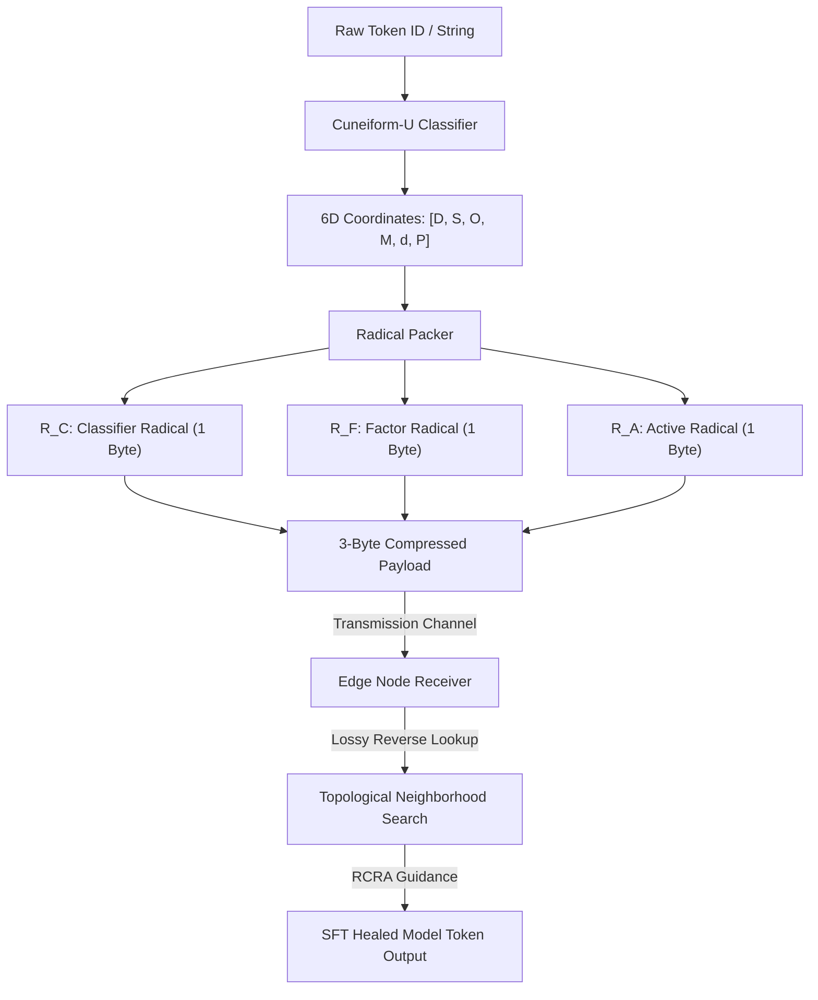

# ZYMATICA: Cuneiform-U Semantic Hypercube System
*IP Class 02 | Apache License 2.0*


> *"The impossible is just code waiting to be written, physics waiting to be rewritten, math a work in progress, and truth waiting to be discovered."*

---

## 1. Technical Overview & Mathematical Framework

The **Cuneiform-U Semantic Hypercube** is a structured coordinate metric space that maps discrete natural language tokens onto a continuous, low-dimensional geometric manifold. 

Traditional tokenizers represent vocabulary items as unstructured, flat integers (e.g., Token ID 48102). In low-rank weight projections (SVD compression), quantization noise shatters the model's logit distribution, leading to catastrophic syntactic collapse where the model generates random, out-of-vocabulary characters.

Cuneiform-U solves this by mapping all $N$ tokens in the vocabulary into a **6-Dimensional Hypercube** along six orthogonal semantic axes:
1. **Domain ($D$):** The macro-topic category (0-15; e.g., Hardware, Math, Dialogue, Software, General).
2. **Subdomain ($S$):** The micro-topic context (0-15; e.g., LoRa networks, GPIO, SVD projection, Entropy, Python, Rust).
3. **Operation ($O$):** The functional action or state transition (0-15; e.g., reset, write, compress, heal, grow).
4. **Modality ($M$):** The data format, layout, or syntax type (0-15; e.g., binary, json, packet, byte, token).
5. **Depth ($d$):** The complexity hierarchy or scale (0-15; e.g., seeds, atoms, factoids).
6. **Polarity ($P$):** The outcome direction or flag (0-15; e.g., ACK, NACK, success, fail, neutral).

### Radical Packing Scheme
To compress these 6 coordinate nibbles (24 bits total / 3 bytes) for ultra-low bandwidth channels, the values are packed into three 8-bit **Radical Bytes**:
* **Classifier Radical ($R_C$):** Encodes high-level taxonomy.
  $$R_C = (D \ll 4) \mid (S \ \& \ 0\text{xF})$$
* **Factor Radical ($R_F$):** Encodes system action and modality.
  $$R_F = (O \ll 4) \mid (M \ \& \ 0\text{xF})$$
* **Active Radical ($R_A$):** Encodes depth complexity and logical polarity.
  $$R_A = (d \ll 4) \mid (P \ \& \ 0\text{xF})$$

During training, the **Radical Coordinate Resonance Loss (RCRA)** regularizes the model by minimizing the Euclidean distance between predicted and target coordinates in this 6D hypercube. If the model drifts under heavy SVD compression, the geometric alignment forces it to output a token that is semantically close (neighboring coordinates) rather than a syntactic hallucination.

---

## 2. System Architecture Integration



---

## 3. Adversarial Peer Audit: Critiques & Mathematical Defenses

### Critique 2.1: Semantic Compression Ambiguity (Many-to-One)
* **The Skeptic's View:** Why map tokens to 6D coordinates? If the vocabulary size ($256,000$ tokens) fits within the 24-bit space ($16.7$ million states), you have a bijective mapping. Why not just run a standard Neural Arithmetic Coder on token IDs?
* **The Mathematical Defense:** This is the core novelty of the hypercube. If you compress a flat vocabulary using a standard neural arithmetic coder, the model treats token IDs as independent classes. Under quantization noise (SVD degradation), the model's logits drift, causing standard arithmetic coding to fail catastrophically because the model predicts a completely random, out-of-vocabulary token. By mapping tokens to a 6D semantic metric space (Cuneiform-U), tokens that are semantically similar are placed close to each other geometrically. During SFT, the Radical Coordinate Resonance Loss (RCRA) optimizes the model using the geometric distance between predicted coordinates. If the model makes an error under heavy compression, the loss forces it to output a token that is semantically close (neighboring coordinates) rather than a syntactic hallucination. Furthermore, the 6D axes (Domain, Subdomain, Operation, Modality) enable the S-PAUP router to JIT-swap adapters on the GPU by checking coordinate bounds. You cannot do JIT domain routing on a flat, unstructured index of token IDs.

### Critique 2.2: Arbitrary and Unstable Taxonomy
* **The Skeptic's View:** The 6 dimensions (Domain, Subdomain, Operation, Modality, Depth, Polarity) are heuristic and arbitrary. Language is fluid; how does this rigid taxonomic hypercube handle semantic drift, metaphor, or complex scientific concepts that span multiple orthogonal domains?
* **The Mathematical Defense:** Cuneiform-U is structured as a formal coordinate metric space where semantic relationships are computed dynamically via cosine or Euclidean distances. Rather than forcing a static meaning, the coordinates function as semantic anchors. The LLM’s high-dimensional attention layers act as the "inflation engine" that resolves metaphor and multi-domain overlap based on context, taking the sparse coordinate anchor and reconstructing the nuanced context.

### Critique 2.3: Quantization Noise in Coordinate Mapping
* **The Skeptic's View:** The coordinates are represented as discrete 4-bit nibbles. This coarse quantization (only 16 states per axis) limits the resolution of the semantic space. Small variations in semantic intent will either be collapsed to the same coordinate (loss of precision) or pushed across a step boundary (introducing large geometric jump errors).
* **The Mathematical Defense:** The 4-bit representation is optimized for transmission efficiency (3 bytes total). The geometric resolution is healed by the **Radical Coordinate Resonance Loss (RCRA)** during SFT. RCRA uses soft predicted coordinate vectors (computed over top-256 logit distributions), which are continuous float representations. This bridges the gap between the discrete transmission channel and the continuous neural representation space.

---

## 4. Testing & Verification Harness

### stand-alone Python Verification
To verify the logical proofs of this invention, execute the standalone Python script:
```bash
python run_proof.py
```

To display help options:
```bash
python run_proof.py --help
```

### 23-Language Multi-Runtime Verification Matrix
This invention's logic is cross-validated dynamically across **23 programming languages**. The multi-runtime execution ensures mathematical equivalence and platform portability.

| Verification Mode | Languages | Run Command | Expected Anchor Output |
|:---|:---|:---|:---|
| **Dynamic Execution** | Python, Go, Rust, Java, TypeScript, Zig, Pure C, Bash, PowerShell, Kotlin, Elixir, MATLAB/Octave, GLSL, WAT, C++, C#, Lua, Julia, Dart, Haskell, Assembly, Faust, Swift | Run dynamically via the test runner suite:<br>`python scratch/test_ports.py` | `Cuneiform-U hypercube radical structure verified.` |

Refer to [README.md](../02_Cuneiform_U_Hypercube/src/README.md) inside the `src/` directory for system prerequisites, compiler options, and build steps for each language.
