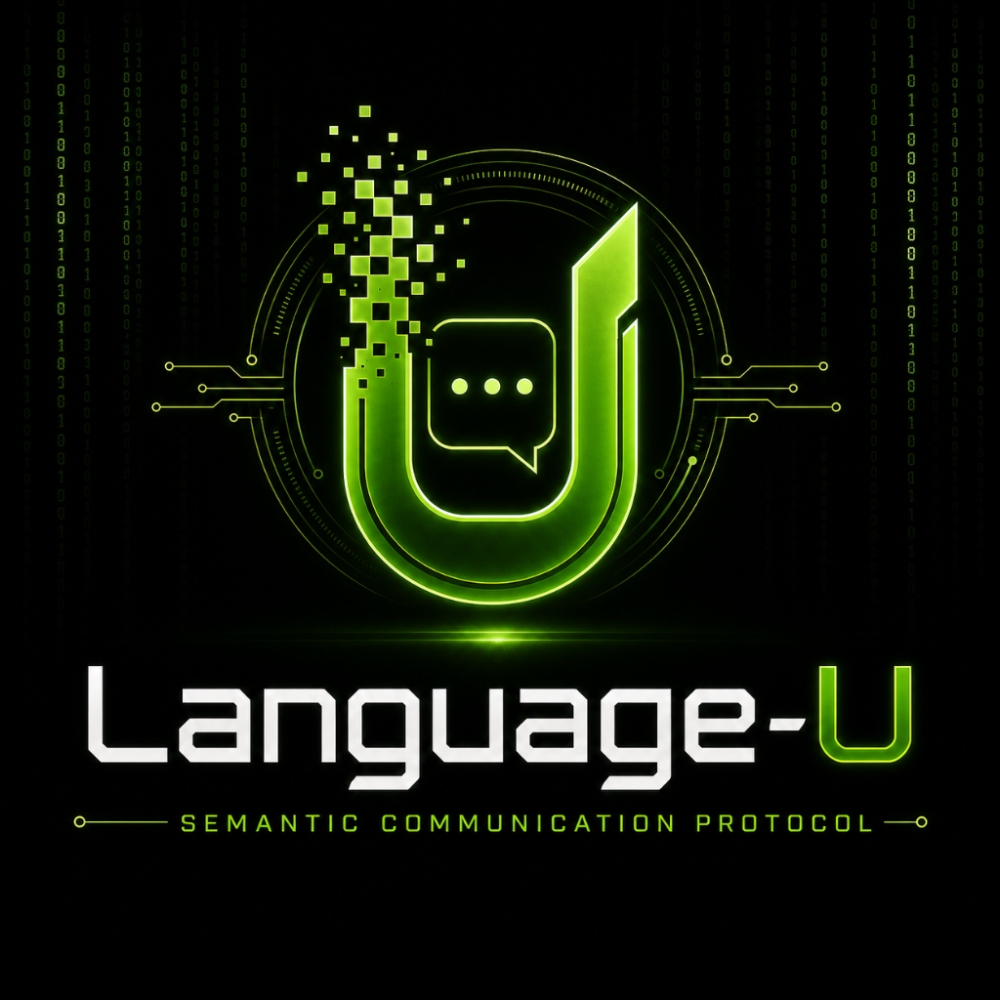

# 28. Solana Semantic Anchor & Payments Gateway



This directory implements the on-chain attestation and payments incentive layers for the **Language-U Semantic Communication Protocol** on the **Solana** blockchain.

---

## 🏗️ Components

1.  **Anchor Smart Contract (`solana-cuneiform-anchor`):**
    *   Located in `programs/solana-cuneiform-anchor/src/lib.rs`
    *   Defines the on-chain PDA account `CoordinateRecord` to store the 6D semantic coordinates (`[DOMAIN, SUBDOMAIN, MODALITY, POLARITY, STRENGTH, DEPTH]`) and corresponding cryptographic `merkle_root` signatures of intents.
    *   Instructions:
        *   `register_coordinates`: Initializes a coordinate record on-chain.
        *   `update_coordinates`: Mutates coordinates, restricted to the original authority.
2.  **TypeScript SDK Client:**
    *   Located in `app/src/cuneiform_client.ts`
    *   An ESM-compliant helper to serialize instructions and deserialize accounts dynamically (calculating discriminators via SHA-256) without requiring a pre-compiled JSON IDL.
3.  **Solana Pay Mesh Gateway:**
    *   Located in `app/src/solana_pay_mock.ts`
    *   Compiles standards-compliant Solana Pay request URLs to handle micro-payments (USDC/USDG) to reward mesh routing nodes.

---

## 🧪 Running the Tests

1. Install dependencies:
   ```bash
   npm install
   ```
2. Run the integration test suite (validates PDA derivations, mock account deserializations, and Solana Pay URI compliance):
   ```bash
   node tests/solana-cuneiform-anchor-standalone.js
   ```

---

## 🦀 Building the Rust Program

Ensure Cargo is installed, then check compilation via:
```bash
cargo check
```
