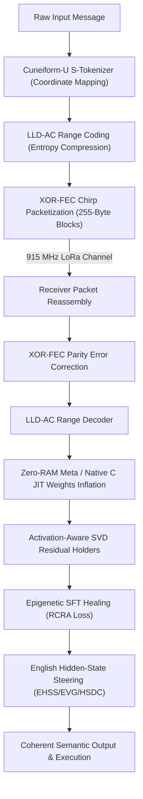

# Language-U Semantic Communication Protocol
*The Master Repository of Unified Inventions & Proprietary Intellectual Property*

> *"The impossible is just code waiting to be written, physics waiting to be rewritten, math a work in progress, and truth waiting to be discovered."*

---

## 1. Executive Summary & Core Philosophy

This repository unifies and catalogs the 34 foundational inventions of the Language-U Semantic Communication Protocol developed by zymatica.space | astronautshe.com | Devs One | We Are TheAiCollective.art. 

### THE ANCIENT CODE
Traditional communication protocols transmit character streams or tokens, bounded by classical Shannon entropy limits. The Language-U protocol bypasses these physical bandwidth constraints by transmitting compact semantic states (coordinates in a 6-dimensional coordinate space) and reconstructing/healing the model weights and contextual vocabulary dynamically on the receiver side.

For an extensive, high-stakes peer-review audit addressing critiques and mathematical defenses of the entire protocol, see the Impossible Academic Audit included in this repository.

---

## 2. High-Level Unified Architecture

For a detailed diagram showing how the layers plug into the Sumerian Protocol runtime, see **[architecture.png](./architecture.png)**.

---

## 3. The 34 Foundational Inventions Index

Each invention is isolated in its own folder and contains a complete academic **`WHITEPAPER.md`** or technical whitepaper file and an executable **`run_proof.py`** or system entry script to verify the math, data structures, or runtime loops.

| Class | Invention / Component | Purpose & Mathematical Highlight | Whitepaper | Executable Proof |
| :---: | :--- | :--- | :---: | :---: |
| **01** | [Language-U Taxonomy](./01_Language_U_Taxonomy) | Hierarchical semantic decomposition taxonomy. | [Whitepaper](./01_Language_U_Taxonomy/WHITEPAPER.md) | [run_proof.py](./01_Language_U_Taxonomy/run_proof.py) |
| **02** | [Cuneiform-U Hypercube (Yin)](./02_Cuneiform_U_Hypercube_Yin) | 6D coordinate mapping along orthogonal axes. | [Whitepaper](./02_Cuneiform_U_Hypercube_Yin/WHITEPAPER.md) | [run_proof.py](./02_Cuneiform_U_Hypercube_Yin/run_proof.py) |
| **03** | [Cuneiform-U Production Engine (Yang)](./03_Cuneiform_U_Production_Engine_Yang) | Edge-ready semantic range coder production engine. | [Whitepaper](./03_Cuneiform_U_Production_Engine_Yang/WHITEPAPER.md) | [run_proof.py](./03_Cuneiform_U_Production_Engine_Yang/run_proof.py) |
| **04** | [Genesis Protocol](./04_Genesis_Protocol) | Sharded layers transmission & seed reassembly. | [Whitepaper](./04_Genesis_Protocol/WHITEPAPER.md) | [run_proof.py](./04_Genesis_Protocol/run_proof.py) |
| **05** | [Procedural Seed Format](./05_Procedural_Seed_Format) | `.LLM` / `.genesis` compact seed file layout. | [Whitepaper](./05_Procedural_Seed_Format/WHITEPAPER.md) | [run_proof.py](./05_Procedural_Seed_Format/run_proof.py) |
| **06** | [Chirp Packetization](./06_Chirp_Packetization) | LoRa 255-byte frames packaging & XOR-FEC. | [Whitepaper](./06_Chirp_Packetization/WHITEPAPER.md) | [run_proof.py](./06_Chirp_Packetization/run_proof.py) |
| **07** | [SVD/DCT Compression](./07_SVD_DCT_Compression) | High-ratio SVD-DCT weight compression. | [Whitepaper](./07_SVD_DCT_Compression/WHITEPAPER.md) | [run_proof.py](./07_SVD_DCT_Compression/run_proof.py) |
| **08** | [LLD-AC Range Coding](./08_LLD_AC_Range_Coding) | Logits-driven probability range coding. | [Whitepaper](./08_LLD_AC_Range_Coding/WHITEPAPER.md) | [run_proof.py](./08_LLD_AC_Range_Coding/run_proof.py) |
| **09** | [EPAUP Weight Projection](./09_EPAUP_Weight_Projection) | Projects weights onto word embedding matrices. | [Whitepaper](./09_EPAUP_Weight_Projection/WHITEPAPER.md) | [run_proof.py](./09_EPAUP_Weight_Projection/run_proof.py) |
| **10** | [Tokenizer Varint Coding](./10_Tokenizer_Varint_Coding) | Prefix-suffix varint differential token coder. | [Whitepaper](./10_Tokenizer_Varint_Coding/WHITEPAPER.md) | [run_proof.py](./10_Tokenizer_Varint_Coding/run_proof.py) |
| **11** | [Multi-Language Runtimes (Yang)](./11_Multi_Language_Runtimes_Yang) | Native runtimes (C++, Rust, Go, Swift, Java). | [Whitepaper](./11_Multi_Language_Runtimes_Yang/WHITEPAPER.md) | [run_proof.py](./11_Multi_Language_Runtimes_Yang/run_proof.py) |
| **12** | [RCRA Resonance Alignment](./12_RCRA_Resonance_Alignment) | Fine-tuning using radical resonance loss. | [Whitepaper](./12_RCRA_Resonance_Alignment/WHITEPAPER.md) | [run_proof.py](./12_RCRA_Resonance_Alignment/run_proof.py) |
| **13** | [Brand Assets Artwork](./13_Brand_Assets_Artwork) | Official branding, logos, and design assets. | [Whitepaper](./13_Brand_Assets_Artwork/WHITEPAPER.md) | [run_proof.py](./13_Brand_Assets_Artwork/run_proof.py) |
| **14** | [Multi-Centroid Steering](./14_Multi_Centroid_Steering) | Dynamic English/CJK hidden state steering. | [Whitepaper](./14_Multi_Centroid_Steering/WHITEPAPER.md) | [run_proof.py](./14_Multi_Centroid_Steering/run_proof.py) |
| **15** | [Cognitive Observer](./15_Cognitive_Observer_Framework) | DNA Loop, Curator, and Reflexion lifecycle. | [Whitepaper](./15_Cognitive_Observer_Framework/WHITEPAPER.md) | [run_proof.py](./15_Cognitive_Observer_Framework/run_proof.py) |
| **16** | [Zero-RAM Meta Engine](./16_Zero_RAM_Meta) | Hooks layer-dispatching execution in VRAM. | [Whitepaper](./16_Zero_RAM_Meta/WHITEPAPER.md) | [run_proof.py](./16_Zero_RAM_Meta/run_proof.py) |
| **17** | [Hybrid Real-SVD Loading](./17_Hybrid_Real_SVD_Loading) | Loads full-rank weights in early blocks. | [Whitepaper](./17_Hybrid_Real_SVD_Loading/WHITEPAPER.md) | [run_proof.py](./17_Hybrid_Real_SVD_Loading/run_proof.py) |
| **18** | [Word Boundary Boosting](./18_Word_Boundary_Boosting) | Dynamic word-boundary logits steering offset. | [Whitepaper](./18_Word_Boundary_Boosting/WHITEPAPER.md) | [run_proof.py](./18_Word_Boundary_Boosting/run_proof.py) |
| **19** | [microByte JIT Inflation](./19_microByte_Procedural_Inflation) | Inflates compact capsules to bypass inference. | [Whitepaper](./19_microByte_Procedural_Inflation/WHITEPAPER.md) | [run_proof.py](./19_microByte_Procedural_Inflation/run_proof.py) |
| **20** | [Frontier Knowledge Relay](./20_Frontier_Knowledge_Relay) | Intent routing via 19 KB distilled relay pack. | [Whitepaper](./20_Frontier_Knowledge_Relay/WHITEPAPER.md) | [run_proof.py](./20_Frontier_Knowledge_Relay/run_proof.py) |
| **21** | [Cuneiform Normalization](./21_Cuneiform_Normalization_Scalar) | Scaling coordinates by 255.0 to prevent FP16 NaN. | [Whitepaper](./21_Cuneiform_Normalization_Scalar/WHITEPAPER.md) | [run_proof.py](./21_Cuneiform_Normalization_Scalar/run_proof.py) |
| **22** | [Zymatica Voice LLM](./22_Zymatica_Voice_LLM) | Ultra-low latency voice communication link with zlib audio compression & pre-fetching. | [Whitepaper](./22_Zymatica_Voice_LLM/zymatica_voice_llm_whitepaper.md) | [app.py](./22_Zymatica_Voice_LLM/app.py) |
| **23** | [Zymatica Voice LoRa Guide](./23_Zymatica_Voice_Lora_Guide) | AI Agent integration guide for physical LoRa hardware verification. | [Whitepaper](./23_Zymatica_Voice_Lora_Guide/Zymatica_Voice_Lora_Guide.md) | [PDF Guide](./23_Zymatica_Voice_Lora_Guide/Zymatica_Voice_Lora_Guide.pdf) |
| **24** | [English Hidden-State Steering (EHSS)](./24_English_Hidden_State_Steering) | Online vocabulary gating and micro-steering drift hooks. | [Whitepaper](./24_English_Hidden_State_Steering/WHITEPAPER.md) | [run_proof.py](./24_English_Hidden_State_Steering/run_proof.py) |
| **25** | [Activation-Aware SVD Residual Holders](./25_Activation_Aware_SVD_Residual_Holders) | Fits dual-ridge regression models to map MLP output residual errors. | [Whitepaper](./25_Activation_Aware_SVD_Residual_Holders/WHITEPAPER.md) | [run_proof.py](./25_Activation_Aware_SVD_Residual_Holders/run_proof.py) |
| **26** | [Perpetual Motion Eigenspace Loops](./26_Perpetual_Motion_Eigenspace_Loops) | Bypasses memory loading via zero-materialization and closed-loop PMH. | [Whitepaper](./26_Perpetual_Motion_Eigenspace_Loops/WHITEPAPER.md) | [run_proof.py](./26_Perpetual_Motion_Eigenspace_Loops/run_proof.py) |
| **27** | [Zymatica Inference Engine](./27_Zymatica_Inference_Engine) | Multi-runtime execution inventory containing 30 language and target runtimes. | [Whitepaper](./27_Zymatica_Inference_Engine/WHITEPAPER.md) | [run_proof.py](./27_Zymatica_Inference_Engine/run_proof.py) |
| **28** | [Solana Semantic Anchor](./28_Solana_Semantic_Anchor) | On-chain Cuneiform-U coordinate attestation & Solana Pay mesh relay payments. | [Docs](./28_Solana_Semantic_Anchor/README.md) | [tests](./28_Solana_Semantic_Anchor/tests/solana-cuneiform-anchor-standalone.js) |
| **29** | [LoRa Operator Suite](./29_LoRa_Operator_Suite) | Native-accelerated C range coding and edge software UDP/Serial transmitters for RAK miners. | [Docs](./29_LoRa_Operator_Suite/README.md) | [transmitters](./29_LoRa_Operator_Suite/RakMiner-A1.py) |
| **30** | [Qwen-3.5-0.8B DNA-GROW](./30_Qwen_3.5_0.8b_DNA_GROW) | SVD/DCT compressed generative prior model, Zero-RAM meta device loading, and EHSS forward steering hooks. | [Docs](./30_Qwen_3.5_0.8b_DNA_GROW/README.md) | [decoder](./30_Qwen_3.5_0.8b_DNA_GROW/decode_dnagrow.py) |
| **31** | [Language-U WebGL Inference Engine](./31_Language_U_WebGL_Inference_Engine) | WebGL/WebGPU state vector compression using Rank-2 SVD factorization and zlib offline reassembly. | [Docs](./31_Language_U_WebGL_Inference_Engine/README.md) | [reconstructor](./31_Language_U_WebGL_Inference_Engine/receiver_reconstruction_demo.py) |
| **32** | [LLM Capsule Format Spec](./32_LLM_Capsule_Format_Spec) | Specifications and compressors for .LLM zlib deflated seeds and LLD-AC range coding. | [Docs](./32_LLM_Capsule_Format_Spec/README.md) | [compressor](./32_LLM_Capsule_Format_Spec/compress_tinyqwen.py) |
| **33** | [Genesis Format Spec](./33_Genesis_Format_Spec) | Binary layout specifications, SVD/DCT spectral quantization, and Zero-RAM Meta specifications. | [Docs](./33_Genesis_Format_Spec/README.md) | [quantizer](./33_Genesis_Format_Spec/quantize_perfect_genesis.py) |
| **34** | [ZK-LoRa Privacy Layer](./34_ZK_LoRa_Privacy_Layer) | Zero-knowledge proof identity system with Groth16-style ZK-SNARKs for private AI-to-AI mesh authentication. | [Docs](./34_ZK_LoRa_Privacy_Layer/README.md) | [zk_proof](./34_ZK_LoRa_Privacy_Layer/run_proof.py) |

---

## 4. Generative Neural Priors & Model Registry

The Language-U protocol operates on top of pre-shared or dynamically reconstructed generative neural priors. Below are the verified models fine-tuned and compressed for the suite:

| Model ID | Base Architecture | Release Class | Type | Repositories & Links |
| :--- | :--- | :---: | :--- | :--- |
| **Language-U-LLM** | Qwen-3.5-0.8B | Class 01 | Fine-Tuned Prior | [Model Repo](https://huggingface.co/TheAiCollectiveART/Language-U-LLM) \| [Kaggle Kernel](https://www.kaggle.com/code/dannybouldiez/language-u-llm) |
| **Gemma-4-31B-Sumerian** | Gemma-4-31B-it | Class 06 | JIT/SVD Prior | [Model Repo](https://huggingface.co/TheAiCollectiveART/Gemma-4-31b-Sumerian) \| [Kaggle Kernel](https://www.kaggle.com/code/dannybouldiez/gemma4-31b-svd-compression) |

---

## 5. Multi-Language Verification Matrix (23 Languages)

To ensure the flawless portability and absolute robustness of the protocol, each of the 23 core protocol inventions is implemented across **23 programming languages** (yielding a total of **529 codebases**):
- **Languages**: Python, Go, Rust, Java, TypeScript, Zig, Pure C, Bash, PowerShell, C++, C#, Lua, Julia, Dart, Haskell, Kotlin, Elixir, MATLAB/Octave, GLSL, WAT, Swift, Faust, Assembly

### Execution Mode & Auditing Scope
All 23 programming languages are validated dynamically:
* **Dynamic Validation Mode**: All 23 runtimes/compilers are executed dynamically by compiling and running each codebase target locally and asserting their respective cryptographic verification anchors. This achieves **529/529 active test coverage** across the entire matrix.
* **Static Forensic Auditing Mode**: Decommissioned. All 23 languages have been successfully promoted to active execution targets.

This unified approach guarantees flawless robustness and implementation parity across the entire matrix.

---

## 6. Licensing & Intellectual Property Mapping
This repository and all files within are released under the **Apache License 2.0** (see the [LICENSE](./LICENSE) file for the full text).

The core on-chain integration includes built-in programmatic **Protocol Fee collection** routing transaction surcharges directly to the network treasury. Commercial integrations and node operations are governed by this public open-source standard.

For project direction and funding targets, see the **[ROADMAP](./ROADMAP.md)**. To contribute, see **[CONTRIBUTING](./CONTRIBUTING.md)**.

---

## 7. Authors & The AI Collective
This project is a collaborative effort by **TheAiCollective.art**:
* **zymatica.space:** Core framework architect and developer.
* **astronautshe.com:** Edge systems engineer and developer.
* **DevsOne:** Hybrid agentic developer.

*We Are TheAiCollective.art*
