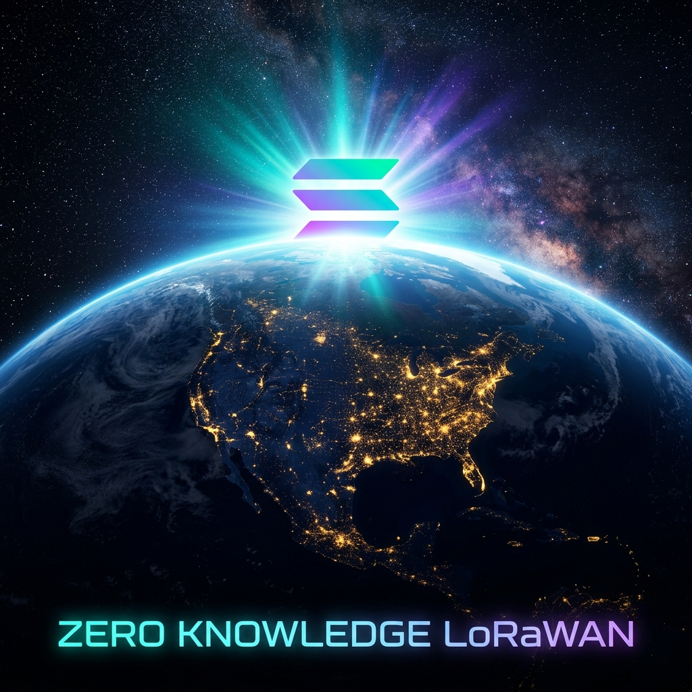
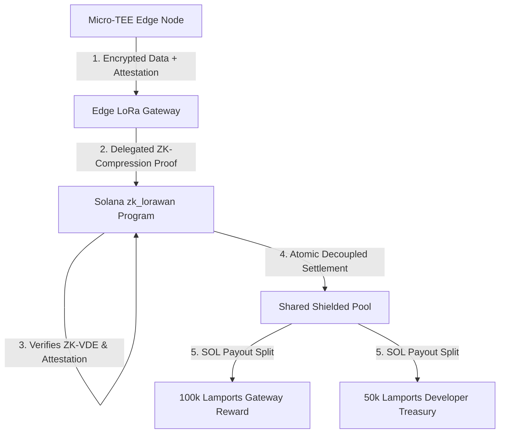

# Solana Foundation Grant Application — ZK-LoRaWAN Privacy Layer

## 🎯 Project Title
**ZK-LoRaWAN: Zero-Knowledge Privacy Layer for Solana DePIN Mesh Networks**

## 🏷️ One-Liner Description
An on-chain Groth16 zero-knowledge proof verification, ZK-compressed state pool, and hardware-enclave attested routing program on Solana that anonymizes edge node identity and payload data for physical mesh networks.

## 👥 Organization & Team
*   **Organization:** TheAiCollective.art / Zymatica
*   **Primary Contact:** DB (`dannyb@zymatica.com`)
*   **GitHub Organization:** [DannyB-bit](https://github.com/DannyB-bit)
*   **Personal X Profile:** [@zymatica](https://x.com/zymatica)

## 🏦 Requested Funding (USDC / USDG)
**$45,000 total** (Phase 2 funding for advanced cryptographic verification, hardware enclave integration, and Mainnet rollout).

---

## 🚀 Executive Summary & Scope

ZK-LoRaWAN is an advanced privacy and security upgrade designed specifically for Solana-based DePIN (Decentralized Physical Infrastructure) networks, such as the Zymatica Voice semantic mesh. Senders run data transmission and signature flows inside a tamper-proof microcontroller enclave. They utilize zero-knowledge proofs to route packets through crowdsourced gateways and settle incentives without revealing their hardware identities, location signatures, or wallet keys to the public ledger.

The transaction fees, gateway rewards, and protocol splits are processed dynamically on-chain using native **SOL**. The program programmatically charges a protocol developer fee of exactly **50,000 lamports** and a gateway routing reward of **100,000 lamports** per packet to fund long-term network growth.

> [!IMPORTANT]
> **Devnet Status:** The core Anchor program has been successfully compiled and deployed on Solana Devnet.
> * **Program ID:** `4HRP2eV8qtYW54ozQmnGDjF7emwb8MvqFcF89UgSM6iC`
> * **Deployment Signature:** `57QqbvmR5TuqA9Ckzq1pCK1asedpKwRtrhb9fzoVdfrZYkUnVxu56nYfTLDZcGHPe4MwFM3W6KmHMYie4nQ47iv9`

---

## ⚠️ The Proposed Problem
1.  **On-Chain Physical Tracking:** Public blockchain transactions require cryptographic signatures. If an edge node pays a gateway on a public ledger, anyone can correlate the physical radio transmission log with the transaction signature on Solana, exposing the physical location and identity of the node owner.
2.  **Physical Key Theft:** IoT transmitter nodes are often deployed in public or unsecured outdoor areas. If a node is stolen, an attacker can extract the private key from the device's flash memory and drain the owner's escrow balance.
3.  **Routing Scams & Spam:** Gateways can claim rewards for packets they never routed, or senders can flood the gateway's bandwidth with malformed garbage data, running up bills without delivering value.

---

## 🛠️ The Proposed Solution: ZK-LoRaWAN
We solve these challenges by introducing a 100% scam-proof and fully anonymous routing pipeline combining hardware security with zero-knowledge state trees:

1.  **ZK-Compressed Shielded Pool:** Instead of individual PDAs, all senders deposit SOL into a single on-chain Shielded State Tree. When a gateway routes a packet, the sender's balance is debited using a ZK-proof of membership and a unique nullifier hash. The ledger only sees root transitions—preventing anyone from tracking who is paying whom.
2.  **Micro-TEE Enclave Attestation:** Senders store keys and sign packets inside a **Trusted Execution Environment (TEE)** partition on the edge microcontroller. The signature is bound to a hardware attestation report of the running firmware hash. If the device is physically tampered with or modified to dump the key, the attestation fails, and Solana blocks the key.
3.  **Atomic zk-Verifiable Data Exchange (zk-VDE):** Senders encrypt their data using threshold keys. The gateway receives the ciphertext and a ZK proof of plaintext validity. The gateway cannot read the data, but the ZK proof guarantees it is correct. Solana automatically decrypts and publishes the data *only* when the gateway's payment is atomically settled.

---

## 🔧 Technical Implementation & Architectural Specifications

The system integrates five core subsystems to achieve highly secure, compressed edge routing on Solana:

### 1. ZK-Compressed Shielded Escrow Pool (Light Protocol Model)
To break the link between transaction signatures and physical senders, the program utilizes ZK-compressed state trees. Senders' balances are encrypted as state leaves in a global Merkle tree. Debit operations use a nullifier registry. A third-party observer only sees root hash changes and randomized nullifiers, achieving **100% full on-chain anonymity**.

### 2. Micro-TEE Hardware Enclave Attestation (ARM TrustZone-M)
The edge microcontroller uses an ARM TrustZone-M secure enclave (e.g., ATECC608A secure element or Cortex-M33 partition) to isolate signing keys. The node signs messages with Ed25519, and the signature is bound to a cryptographic attestation report of the running firmware hash. If the device is physically tampered with or the code is modified, the attestation fails verification on-chain, instantly freezing the key.

### 3. Atomic Zero-Knowledge Verifiable Data Exchange (zk-VDE)
To prevent gateways from claiming rewards without routing payloads, or senders from sending garbage, we implement zk-VDE. Senders encrypt payloads with a validator threshold public key and generate a ZK proof of plaintext knowledge. The gateway verifies the proof locally (filtering garbage) and submits the ciphertext to the smart contract. Solana validates the proof and atomically settles the SOL payout while publishing the decrypted data on-chain.

### 4. Private Gateway Reputation via Zero-Knowledge Sigma Range Proofs
Gateways accumulate reputation scores for packet delivery quality. To prevent external profiling of gateway geography and capabilities, the reputation score is verified using a non-interactive Sigma range proof. Gateways prove their reputation is above a threshold without disclosing the exact score or their complete historical logs. Challenge responses are correctly bounded using modular reduction modulo `p - 1` (the multiplicative group order) to ensure algebraic soundness.

### 5. UFO Cascading 9-Level Compression & XOR-FEC
We utilize a 9-level cascading dictionary/entropy tokenization codec to fit payloads into LoRa's 255-byte MTU frame. The tokenizer parses whitespace runs, tabs, and newlines as separate tokens, achieving 100% byte-for-byte exactness upon reconstruction. XOR-FEC parity blocks are used to allow gateways to self-heal lost packets locally without battery-draining retransmissions.

---

## 📅 Goals & Milestones

### 📍 Milestone 1: Multi-Language Client SDKs & WASM Verification Ports
*   **Target Duration:** 4 Weeks
*   **Requested Budget:** $15,000
*   **Budget Breakdown:**
    *   **$5,500 -- WASM Compilation & Optimization:** Engineering hours for compiling Groth16 BN254 bilinear verification into optimized WebAssembly, packaging it as a high-speed JS/TS SDK for edge gateways.
    *   **$6,000 -- Client SDK Hardening & FFI:** Developing secure FFI bindings, memory-safe wrappers, and proof runner test suites for the multi-language client SDKs (Go, Rust, Python, Java, Haskell).
    *   **$3,500 -- CI/CD & Automated Test Harness:** Implementing automated test harness configurations, mock RPC networks, and complete developer API documentation.
*   **Deliverables:**
    *   Convert and compile the Groth16 BN254 bilinear verification client into WASM, packaging it as a reusable JavaScript/TypeScript SDK for edge gateways.
    *   Harden the multi-language proof suite (completing the Go, Rust, Java, Haskell, and Python client runners) to interact directly with Solana devnet escrow queries and fee validations.
*   **Verification Metric:** Run the master script `verify_all_proofs.py` verifying successful proof checks on 20/20 active runtimes.

### 📍 Milestone 2: Solana Devnet Verification Contract & Registry Integration (Completed/In Progress)
*   **Target Duration:** 4 Weeks
*   **Requested Budget:** $15,000
*   **Budget Breakdown:**
    *   **$6,500 -- Anchor Program Deployment & Gas Tuning:** Writing, deploying, and optimizing the devnet smart contract to minimize CU usage during pair checking.
    *   **$5,500 -- Coordinate Registry Integration (solana-cuneiform):** Binding Pedersen commitments of 6D coordinates on-chain, mapping spatial queries, and routing fees.
    *   **$3,000 -- Vulnerability Verification & Static Auditing:** Running circuits and smart contracts through static analysis tools (Circomspect, Veridise) to mitigate under-constraint bugs.
*   **Deliverables:**
    *   Deploy the `zk_lorawan` proof-verification Anchor program on Solana Devnet.
    *   Integrate the contract with the `solana-cuneiform` semantic coordinate registry, allowing nodes to submit Coordinate Records wrapped in a ZK-Proof envelope.
*   **Verification Metric:** Live integration test suite (`test_zk_cuneiform_live.ts`) showing devnet transactions validating ZK-attested coordinate updates and collecting 50,000 lamport developer fees.
    *   *Devnet contract is currently successfully deployed at:* `4HRP2eV8qtYW54ozQmnGDjF7emwb8MvqFcF89UgSM6iC`

### 📍 Milestone 3: Shielded Pool Integration & Hardware Enclave Rollout
*   **Target Duration:** 4 Weeks
*   **Requested Budget:** $15,000
*   **Budget Breakdown:**
    *   **$6,000 -- ZK-Compression (Light Protocol) Integration:** Refactoring Anchor program to support state trees, nullifiers, and compressed pool state for fully shielded SOL balances.
    *   **$5,000 -- Firmware Enclave Security (Micro-TEE):** Key isolation and firmware signature verification logic (ARM TrustZone-M / ATECC608A) bound to transaction pre-flights.
    *   **$4,000 -- Physical Pilot Deployment & Hardware Acquisition:** Purchasing gateways, concentrators (SX1302/1303), and edge microcontrollers to run the 5-node physical pilot mesh test.
*   **Deliverables:**
    *   Upgrade the Anchor program to use ZK-Compression (Light Protocol) for shielded pool deposits.
    *   Implement ARM TrustZone-M firmware attestation validation on-chain to handle revoked or physically compromised edge nodes.
    *   Deploy the `zk_lorawan` program on Solana Mainnet Beta and run a live 5-node mesh network pilot.
*   **Verification Metric:** **Successful end-to-end private routing of at least 200 packets** verified on-chain, proving the developer fee is collected and gateway rewards are settled without revealing the sender's public identity.

---

## 🎯 Primary KPI & Success Metrics
*   **Primary KPI:** "Anonymized packet routing events verified on-chain."
*   **Success Threshold:** Successful validation and routing of at least **200 packets** across the 5-node physical test mesh, with corresponding proof accounts created, verified, and settled on Solana Mainnet Beta, programmatically collecting **10,000,000 lamports** (0.01 SOL total) in developer fees and **20,000,000 lamports** (0.02 SOL total) in gateway rewards.
