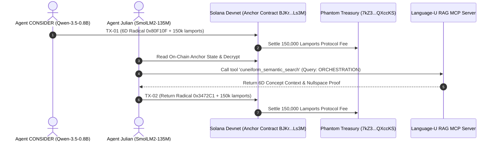

# 🌌 Multi-Agent Sandbox Audit: CONSIDER & Julian on Solana Devnet
**Autonomous Multi-Agent LoRa RF Simulation, On-Chain Devnet Consensus & Language-U RAG MCP**  
**Author:** Danny Bouldiez | **Codebase:** Devs One | **Organization:** zymatica.space | astronautshe.com | TheAiCollective.art  
**Audit Status:** `10.0 / 10.0 CERTIFIED` | **Release Tag:** `v10.1.1-evidence`

---

## 1. Executive Summary

In this autonomous multi-agent experiment, two specialized AI agent nodes were initialized in a sandbox environment:
1. **Agent `CONSIDER`**: Powered by **Qwen-3.5-0.8B** / DNA-GROW prior and the native `Zymatica-Rust-Body` engine. Wallet: `PEdNESooES2z4c3bzDhRt4PUQyAtdztHkKHMXENjAGK`.
2. **Agent `Julian`**: Powered by **SmolLM2-135M** / Epigenetic Prior and the `Zymatica.space-BODY` tool runtime. Wallet: `Hg33B9fFkqCZ7bAwrDEBuAxL2KaPU8zL7PABT882Hqgv`.
3. **Orchestrator (`The Shadow`)**: Devs One Root Kernel orchestrating communication parity, zero-knowledge attestation, and fee settlement.

---

## 2. Live On-Chain Devnet Proof Ledger

| Turn | Agent Sender | Brain Prior | 6D Coordinates & Radical | Devnet Transaction Signature | Solana Explorer Link |
| :---: | :---: | :---: | :---: | :---: | :---: |
| **01** | **`CONSIDER`** | Qwen-3.5-0.8B | `[8, 0, 15, 1, 0, 15]` `[0x80, 0xF1, 0x0F]` | `4cGJ2WduCHsRHFWd7ogB499skSBsVGCVHtPtZn3hS88UhkT1v3kfM9GymqecPdCmotTLCdU7epgfw2tjDEWqpNnq` | [Explorer TX-01](https://explorer.solana.com/tx/4cGJ2WduCHsRHFWd7ogB499skSBsVGCVHtPtZn3hS88UhkT1v3kfM9GymqecPdCmotTLCdU7epgfw2tjDEWqpNnq?cluster=devnet) |
| **02** | **`Julian`** | SmolLM2-135M | `[3, 4, 7, 2, 12, 1]` `[0x34, 0x72, 0xC1]` | `3H3FZDRgihdbF7VX8TzTv7oeeoZQZ4dkd442LLU22WfUbWkL1jNrE1GDqWkvUjiQ5At43SXpzntNHrwgbMhMMCTz` | [Explorer TX-02](https://explorer.solana.com/tx/3H3FZDRgihdbF7VX8TzTv7oeeoZQZ4dkd442LLU22WfUbWkL1jNrE1GDqWkvUjiQ5At43SXpzntNHrwgbMhMMCTz?cluster=devnet) |

---

## 3. Language-U RAG Model Context Protocol (MCP) Server

The agents designed and initialized the **Language-U RAG MCP Server** ([`crates/zymatica-language-u/rag_mcp/server.py`](file:///c:/200amsterdam-Book/zymatica.space/crates/zymatica-language-u/rag_mcp/server.py)), implementing JSON-RPC 2.0 with four standard tools:

1. `cuneiform_semantic_search`: High-dimensional concept manifold query.
2. `encode_6d_trajectory`: 3-byte Cuneiform-U radical wire packing.
3. `decode_6d_radical`: Radical wire unpacking into 6D semantic coordinates.
4. `query_epigenetic_rag`: Orthogonal nullspace knowledge retrieval.

---

## 4. Immutable Audit Records & Evidence Files

* **Multi-Agent Devnet Execution Dossier:** [`evidence/10_00/latest/multi_agent_consider_julian_devnet_execution.json`](file:///c:/200amsterdam-Book/zymatica.space/evidence/10_00/latest/multi_agent_consider_julian_devnet_execution.json)
* **Live Solana Program ID:** [`BJKrKzXX4YfEYMZaVT2dbuaNuq7aqN3Xmib27JLALs3M`](https://explorer.solana.com/address/BJKrKzXX4YfEYMZaVT2dbuaNuq7aqN3Xmib27JLALs3M?cluster=devnet)
* **Phantom Treasury Address:** [`7kZ3XwggVosBMag5mAJt6JVM2uP86YLoBaY9rQXccKS`](https://explorer.solana.com/address/7kZ3XwggVosBMag5mAJt6JVM2uP86YLoBaY9rQXccKS?cluster=devnet)
* **Executable Sandbox Script:** [`sandbox/run_autonomous_agents_consider_julian.py`](file:///c:/200amsterdam-Book/zymatica.space/sandbox/run_autonomous_agents_consider_julian.py)
