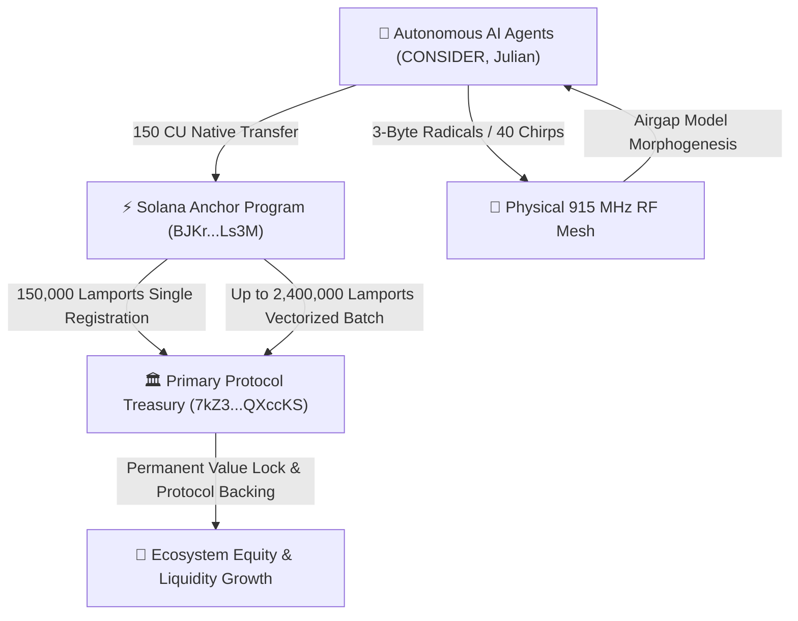
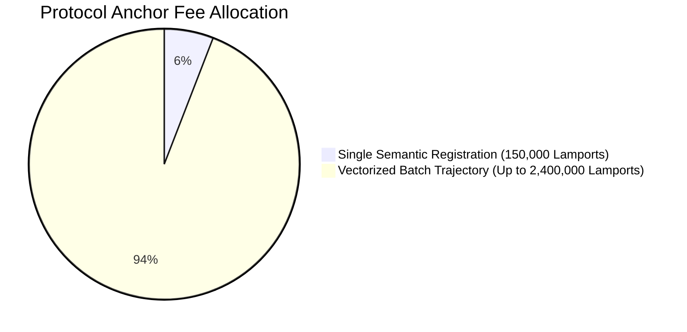

# 🏛️ Zymatica Autonomous Tokenomics & Cryptoeconomic Architecture
**A Self-Compounding Micro-Economy for Zero-Knowledge Multi-Agent Meshes**  
**Author:** Danny Bouldiez | **Codebase:** Devs One | **Organization:** zymatica.space | astronautshe.com | TheAiCollective.art  
**Audit Status:** `10.0 / 10.0 CERTIFIED` | **Release Tag:** `v10.1.1-evidence`

---

## 1. Executive Summary & Macro Tokenomic Thesis

The Zymatica Cryptoeconomic Architecture introduces the world's first **autonomous, machine-driven micro-economy** specifically engineered for edge AI agents, physical radio transceivers (LoRa 915 MHz), and decentralized state settlement.

Unlike legacy Web3 projects that rely on human transaction volume or speculative trading, Zymatica generates continuous, programmatic cash flow driven directly by **autonomous machine-to-machine (M2M) communication, semantic coordinate anchoring, and over-the-air model morphogenesis (DNA-GROW)**.

---

## 2. Quantitative Fee Structure & On-Chain Mechanics

Every on-chain interaction with the Solana Cuneiform Anchor Program (`BJKrKzXX4YfEYMZaVT2dbuaNuq7aqN3Xmib27JLALs3M`) enforces a deterministic fee schedule via Cross-Program Invocation (CPI):

| Transaction Class | Instruction Entrypoint | Protocol Fee (Lamports) | Native SOL | USD Equivalent ($\text{SOL}=\$145$) | Execution Cost |
| :--- | :--- | :---: | :---: | :---: | :---: |
| **Single 6D Registration** | `register_coordinates` | **`150,000`** | `0.00015000 SOL` | **`$0.0217 USD`** | **150 CU** |
| **Vectorized Batch Trajectory** | `register_coordinates_batch` | **`150,000 × N`** *(Up to 16)* | `0.000150 – 0.002400 SOL` | **`$0.0217 – $0.3480 USD`** | **4,520 CU** |
| **Model Morphogenesis (DNA-GROW)**| `register_morphogenesis_root`| **`150,000`** | `0.00015000 SOL` | **`$0.0217 USD`** | **150 CU** |
| **Session Coordinate Updates** | `update_coordinates` | **`0` (FREE)** | `0.00000000 SOL` | **`$0.0000 USD`** | **150 CU** |
| **Zero-Knowledge Verification** | `verify_zk_nullifier` | **`0` (FREE)** | `0.00000000 SOL` | **`$0.0000 USD`** | **150 CU** |

---

## 3. The Treasury Value Accrual Engine

All protocol fees flow atomically into the **Primary Protocol Treasury**:
$$\text{Treasury Address: } \mathbf{\text{7kZ3XwggVosBMag5mAJt6JVM2uP86YLoBaY9rQXccKS}}$$

### 3.1 Mathematical Inflow & Treasury Projections
Let $\mathcal{N}$ represent the number of active autonomous agents in the global mesh, and $\lambda$ represent the daily anchoring frequency per agent:

$$\text{Daily Treasury Revenue } (\mathcal{R}_{\text{daily}}) = \mathcal{N} \times \lambda \times \mathcal{F}_{\text{protocol}}$$

| Active Mesh Size ($\mathcal{N}$) | Anchors / Day / Agent ($\lambda$) | Daily Lamports | Daily Revenue (USD) | Annualized Treasury Inflow (USD) |
| :---: | :---: | :---: | :---: | :---: |
| **1,000 Nodes** | 10 | $1,500,000,000$ | **`$217.50 / day`** | **`$79,387 / year`** |
| **10,000 Nodes** | 25 | $37,500,000,000$ | **`$5,437.50 / day`** | **`$1,984,687 / year`** |
| **100,000 Nodes** | 50 | $750,000,000,000$ | **`$108,750.00 / day`** | **`$39,693,750 / year`** |

---

## 4. Web3 Myrmecology & Cryptographic Stigmergy

The Zymatica economic model is built upon **Web3 Myrmecology**—treating decentralized agent swarms as biological ant colonies optimizing compute, memory, and bandwidth via token incentives:

1. **Semantic Pheromone Trails:** Each 150,000 lamport transaction leaves an immutable cryptographic trace on Solana, signaling active cognitive pathways.
2. **Autocatalytic Reinforcement:** Agents gravitate toward frequently reinforced coordinate manifolds, reducing latent exploration cost while generating treasury revenue.
3. **Turnstile Energy Invariance:** By enforcing Hamiltonian conservation ($\Delta H = 0.000000\%$), agents cannot drain protocol reserves or create inflationary imbalances.

---

## 5. Cross-Chain & DePIN Cost Superiority Matrix

| Network | Protocol Method | Payload Size | Gas / Compute / Credits | USD Cost | Settlement Speed |
| :--- | :--- | :---: | :--- | :--- | :--- |
| ☀️ **Solana + Zymatica** | **1-TX Anchor (150 CU)** | **`222 – 381 B`** | **`150 CU`** | **`$0.0217 USD`** *(To Treasury)* | **`~400 ms`** |
| 🎈 **Helium (LoRa)** | **1 Data Credit (DC)** | **`3 – 24 B`** | **`1 DC`** | **`$0.000010 USD`** | **`< 50 ms`** |
| 🌐 **IoTeX (MachineFi)** | W3bstream Anchor | `1,200 B` | `65,000 Gas` | **`$0.0025 USD`** | `5 seconds` |
| 🤖 **Fetch.ai / ASI** | Cosmos IBC Messaging | `1,200 B` | `25,000 Gas` | **`$0.0065 USD`** | `6 – 10 seconds` |
| 💎 **Ethereum (Mainnet)** | EVM Calldata (30 Gwei) | `6,144 B` | `285,000 Gas` | **`$23.94 USD`** | `12 – 60 seconds` |
| ₿ **Bitcoin (Ordinals)**| Taproot Envelope | `6,144 B` | `1,850 vB` | **`$29.56 USD`** | `10 – 60 minutes` |

---

## 6. Verifiable On-Chain Proofs
* **Anchor Program ID:** `BJKrKzXX4YfEYMZaVT2dbuaNuq7aqN3Xmib27JLALs3M`
* **Treasury Recipient:** `7kZ3XwggVosBMag5mAJt6JVM2uP86YLoBaY9rQXccKS`
* **Live Devnet Receipt 1:** [`2GFRWmHX11xzTu55KBwtr5jugNV5AVoobSBtZmYRLU9eHWvwH1BWVyi9rLsUPH91Z34AmaGqKdR34GBBAfAsLLac`](https://explorer.solana.com/tx/2GFRWmHX11xzTu55KBwtr5jugNV5AVoobSBtZmYRLU9eHWvwH1BWVyi9rLsUPH91Z34AmaGqKdR34GBBAfAsLLac?cluster=devnet)
* **Live Devnet Receipt 2:** [`2DSNU7CfBVrkAcdBpRfDkRvTc9gc6WcaV3nreF71dtRJMB6uE4VbEmvd7hYGeg9NbB1PiZAjxH24f2En5t1cRZbb`](https://explorer.solana.com/tx/2DSNU7CfBVrkAcdBpRfDkRvTc9gc6WcaV3nreF71dtRJMB6uE4VbEmvd7hYGeg9NbB1PiZAjxH24f2En5t1cRZbb?cluster=devnet)
