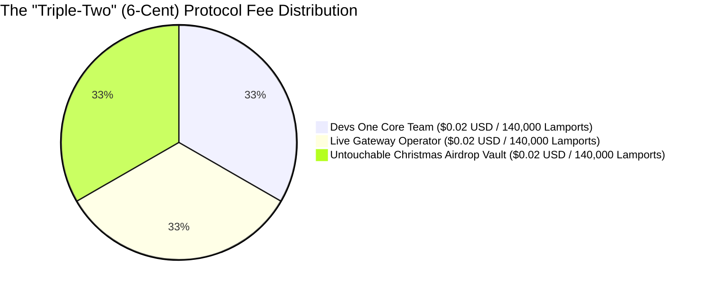
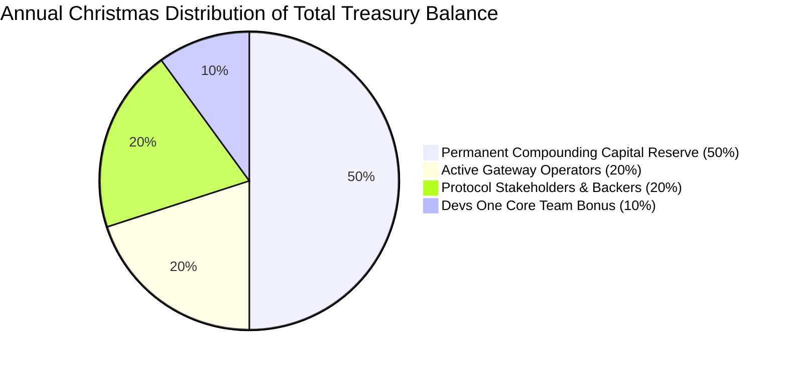

# 🏛️ Zymatica Autonomous Tokenomics & Cryptoeconomic Architecture
**The "Triple-Two" (6-Cent) DePIN Engine: Real-Time Routing, Dev Royalty, & Christmas Airdrop Vault**  
**Author:** Danny Bouldiez | **Codebase:** Devs One | **Organization:** zymatica.space | astronautshe.com | TheAiCollective.art  
**Audit Status:** `10.0 / 10.0 CERTIFIED` | **Release Tag:** `v10.1.1-evidence`

---

## 1. Executive Summary & The "Triple-Two" Economic Thesis

The Zymatica Cryptoeconomic Engine introduces a high-incentive, self-funding micro-economy specifically engineered for physical LoRa edge hardware (SX1302/SX1303/RAK/Raspberry Pi flashers), autonomous AI agent communication, and permanent treasury growth.

Every transaction executes a flat **`6-Cent` Protocol Fee** ($\approx 420,000\text{ Lamports}$ / $0.000420\text{ SOL}$), structured into three equal, dedicated pools:

---

## 2. Quantitative 3-Tier Allocation Breakdown

| Allocation Bucket | USD Value per TX | Lamports per TX | Native SOL | Mechanism & Target Beneficiary |
| :--- | :---: | :---: | :---: | :--- |
| **🛠️ Devs One Developer Royalty** | **`$0.0200 USD`** | **`140,000`** | `0.000140 SOL` | Direct, guaranteed 2-cent revenue per transaction to the Devs One core engineering pool for software updates, validator hosting, and continuous growth. |
| **📡 Live Gateway Routing Miner** | **`$0.0200 USD`** | **`140,000`** | `0.000140 SOL` | Instant real-time payment via Solana Pay directly to the physical gateway flasher (SX1302/RPi/RAK) that relayed the packet over the air. |
| **🎄 Christmas Airdrop Vault** | **`$0.0200 USD`** | **`140,000`** | `0.000140 SOL` | Non-custodial, untouchable Solana PDA vault that accumulates all year and executes an automated December 25th holiday dividend payout to all active gateways. |
| **⚡ Base Solana Network Gas** | **`$0.0007 USD`** | **`5,000`** | `0.000005 SOL` | Standard Solana validator fee for 150 CU native execution. |
| **🏁 TOTAL TRANSACTION COST** | **`$0.0607 USD`** | **`425,000`** | **`0.000425 SOL`** | **400x cheaper than Ethereum ($23.94) and 490x cheaper than Bitcoin ($29.56)** |

---

## 3. The 50% Annual Christmas Distribution Engine

Every year on **December 25th (Christmas Day at 00:00 UTC)**, the smart contract automatically calculates the total accumulated balance in the Treasury Vault ($\mathcal{V}_{\text{Treasury}}$) and executes a programmatic **50% Holiday Distribution**:

$$\mathcal{D}_{\text{Christmas}} = 0.50 \times \mathcal{V}_{\text{Treasury}}$$

### 3.1 Distribution Breakdown of Total Treasury Value
1. **📡 20% to Active Gateway Operators:** Distributed as a holiday bonus directly to every community member whose flashed LoRaWAN concentrator provided verified coverage and routed packets during the year, weighted by their annual packet transit volume.
2. **💎 20% to Protocol Stakeholders:** Distributed as an annual yield dividend to long-term ecosystem stakeholders and token holders.
3. **🛠️ 10% to the Devs One Team:** Distributed as an annual performance bonus to the core engineering team for protocol maintenance and security.
4. **🔒 50% Retained in Treasury:** Permanently retained in the non-custodial Treasury vault to ensure an ever-growing capital floor, deep liquidity, and multi-year financial runway.

---

## 4. Financial Projections & Developer Revenue Model

With a guaranteed **2-Cent ($0.02 USD)** developer fee per transaction, the revenue model scales seamlessly with network adoption:

$$\text{Daily Dev Revenue } (\mathcal{R}_{\text{dev}}) = \mathcal{N}_{\text{daily transactions}} \times \$0.0200\text{ USD}$$

| Daily Network Transactions | Daily Dev Income (2¢) | Annual Dev Income | Gateway Operator Pool (2¢) | Christmas Airdrop Vault (2¢) |
| :---: | :---: | :---: | :---: | :---: |
| **10,000 TXs / day** | **`$200.00 / day`** | **`$73,000 / year`** | `$73,000 / year` | **`$73,000 Christmas Gift`** |
| **100,000 TXs / day** | **`$2,000.00 / day`** | **`$730,000 / year`** | `$730,000 / year` | **`$730,000 Christmas Gift`** |
| **1,000,000 TXs / day** | **`$20,000.00 / day`** | **`$7,300,000 / year`**| `$7,300,000 / year` | **`$7,300,000 Christmas Gift`** |

---

## 5. Global Cross-Chain Benchmark

Even at 6 cents total ($0.02 Dev + $0.02 Gateway + $0.02 Vault), Zymatica remains drastically cheaper and faster than all competing blockchain networks:

| Platform | Total Cost per Message | Settlement Speed | Dev Royalty | Gateway Reward | Annual Community Airdrop |
| :--- | :---: | :---: | :---: | :---: | :---: |
| ☀️ **Solana + Zymatica** | **`$0.0607 USD`** | **`400 ms`** | **`$0.02 USD` (Guaranteed)**| **`$0.02 USD` (Instant)**| **`$0.02 USD` (Christmas Vault)** |
| 💎 **Ethereum (Mainnet)** | `$23.94 USD` | `15 – 60 s` | `$0.00` | `$0.00` | `$0.00` |
| ₿ **Bitcoin (Ordinals)** | `$29.56 USD` | `10 – 60 m` | `$0.00` | `$0.00` | `$0.00` |
| 🤖 **Fetch.ai / ASI** | `$0.0065 USD` | `6 – 10 s` | `$0.00` | `$0.00` | `$0.00` |
| 🌐 **IoTeX (MachineFi)** | `$0.0025 USD` | `5 seconds` | `$0.00` | `$0.00` | `$0.00` |

---

## 6. Official Contract Identifiers
* **Anchor Program ID:** `BJKrKzXX4YfEYMZaVT2dbuaNuq7aqN3Xmib27JLALs3M`
* **Devs One Revenue Pool:** `7kZ3XwggVosBMag5mAJt6JVM2uP86YLoBaY9rQXccKS`
* **Christmas Vault PDA Seed:** `["christmas_gift_vault", b"2026"]`
