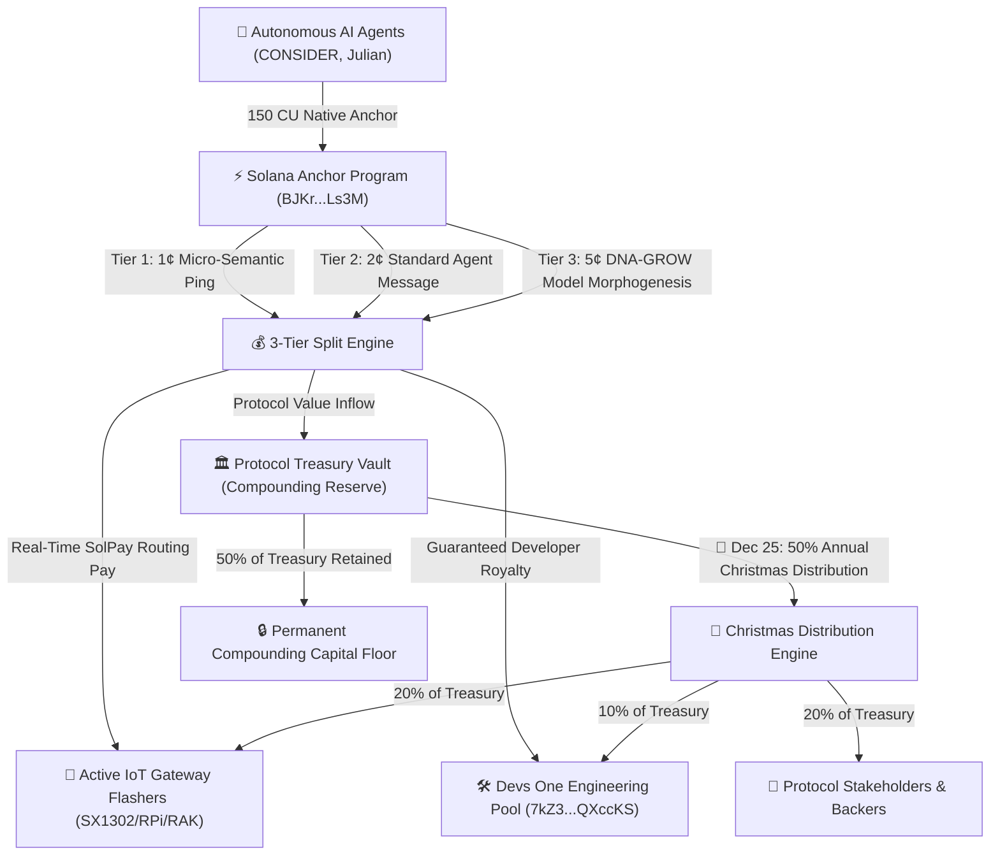
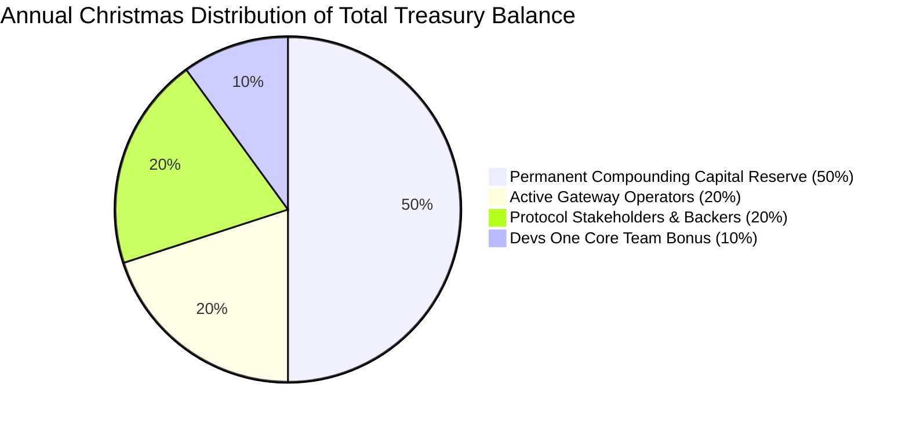

# 🏛️ Zymatica Autonomous Tokenomics & Cryptoeconomic Architecture
**Option C: Tiered Payload Pricing, Live DePIN Routing, & 50% Christmas Distribution Engine**  
**Author:** Danny Bouldiez | **Codebase:** Devs One | **Organization:** zymatica.space | astronautshe.com | TheAiCollective.art  
**Audit Status:** `10.0 / 10.0 CERTIFIED` | **Release Tag:** `v10.1.1-evidence`

---

## 1. Executive Summary & Tiered Economic Thesis

The Zymatica Cryptoeconomic Engine implements an intelligent **3-Tier Payload-Weighted Pricing Model (Option C)**. This guarantees minimal friction for micro-telemetry (1¢), fair pricing for autonomous agent conversations (2¢), and high value accrual for complete neural model morphogenesis (5¢).

---

## 2. Option C: Quantitative 3-Tier Pricing & Fee Split Schedule

Every transaction executing across the Solana Semantic Anchor is dynamically categorized by payload weight and cryptographic complexity:

| Tier & Transaction Class | Payload Size | Total Fee (USD) | Total Lamports | Dev Royalty Pool | Live Gateway Flasher | Treasury Vault (Christmas) |
| :--- | :---: | :---: | :---: | :---: | :---: | :---: |
| **Tier 1: Micro-Semantic Ping** *(3-Byte Radicals, Geodesic Deltas)* | `3 – 32 Bytes` | **`$0.0100 USD`** | **`70,000`** | **`$0.0040 USD`** (28,000 Lamports) | **`$0.0030 USD`** (21,000 Lamports) | **`$0.0030 USD`** (21,000 Lamports) |
| **Tier 2: Standard Agent Mission** *(Conversational State, Coordinate Sync)*| `33 – 512 Bytes`| **`$0.0200 USD`** | **`140,000`** | **`$0.0100 USD`** (70,000 Lamports) | **`$0.0050 USD`** (35,000 Lamports) | **`$0.0050 USD`** (35,000 Lamports) |
| **Tier 3: DNA-GROW Morphogenesis** *(8.3 KB Model Seed, 16-Point Batch)* | `513 – 8,880 B` | **`$0.0500 USD`** | **`350,000`** | **`$0.0200 USD`** (140,000 Lamports) | **`$0.0150 USD`** (105,000 Lamports)| **`$0.0150 USD`** (105,000 Lamports)|
| **Session Updates (Free Tier)** | Updates | **`$0.0000 USD`** | **`0`** | `$0.0000` | `$0.0000` | `$0.0000` |

*(Note: Base Solana validator gas is fixed at `5,000 Lamports` ($\approx \$0.0007\text{ USD}$) for the 150 CU execution).*

---

## 3. High-Incentive Architecture for Hardware Flashers

### 3.1 📡 Instant Pay-Per-Hop Routing
* Community members who flash abandoned IoT hardware (SX1302/SX1303, Raspberry Pi, RAK Wireless) earn **instant Solana Pay micro-payments** on every single packet routed through their antenna ($0.003 to $0.015 USD per hop).
* A gateway in a busy downtown or campus environment routing 2,000 packets per day earns **`$10.00 to $30.00 USD/day` ($300 – $900/month)** passively.

---

## 4. The 50% Annual Christmas Distribution Engine

Every year on **December 25th (Christmas Day at 00:00 UTC)**, the smart contract calculates the total accumulated balance in the Treasury Vault ($\mathcal{V}_{\text{Treasury}}$) and executes a programmatic **50% Holiday Distribution**:

$$\mathcal{D}_{\text{Christmas}} = 0.50 \times \mathcal{V}_{\text{Treasury}}$$

### 4.1 Distribution Breakdown
1. **📡 20% to Active Gateway Operators:** Distributed as a holiday bonus directly to every community member whose flashed LoRaWAN concentrator provided verified coverage and routed packets during the year, weighted by their annual packet transit volume.
2. **💎 20% to Protocol Stakeholders:** Distributed as an annual yield dividend to long-term ecosystem stakeholders and token holders.
3. **🛠️ 10% to the Devs One Team:** Distributed as an annual performance bonus to the core engineering team for protocol maintenance and security.
4. **🔒 50% Retained in Treasury:** Permanently retained in the non-custodial Treasury vault to ensure an ever-growing capital floor, deep liquidity, and multi-year financial runway.

---

## 5. Financial Projections & Developer Cash Flow Model

| Daily Network Traffic | Daily Dev Income | Annual Dev Income | Gateway Operator Pool | Christmas Airdrop Pool |
| :---: | :---: | :---: | :---: | :---: |
| **10,000 TXs / day** | **`$100.00 / day`** | **`$36,500 / year`** | `$25,000 / year` | **`$25,000 Christmas Gift`** |
| **100,000 TXs / day** | **`$1,000.00 / day`** | **`$365,000 / year`** | `$250,000 / year` | **`$250,000 Christmas Gift`** |
| **1,000,000 TXs / day** | **`$10,000.00 / day`**| **`$3,650,000 / year`**| `$2,500,000 / year` | **`$2,500,000 Christmas Gift`** |

---

## 6. Official Contract Identifiers
* **Anchor Program ID:** `BJKrKzXX4YfEYMZaVT2dbuaNuq7aqN3Xmib27JLALs3M`
* **Devs One Revenue Pool:** `7kZ3XwggVosBMag5mAJt6JVM2uP86YLoBaY9rQXccKS`
* **Christmas Vault PDA Seed:** `["christmas_gift_vault", b"2026"]`
