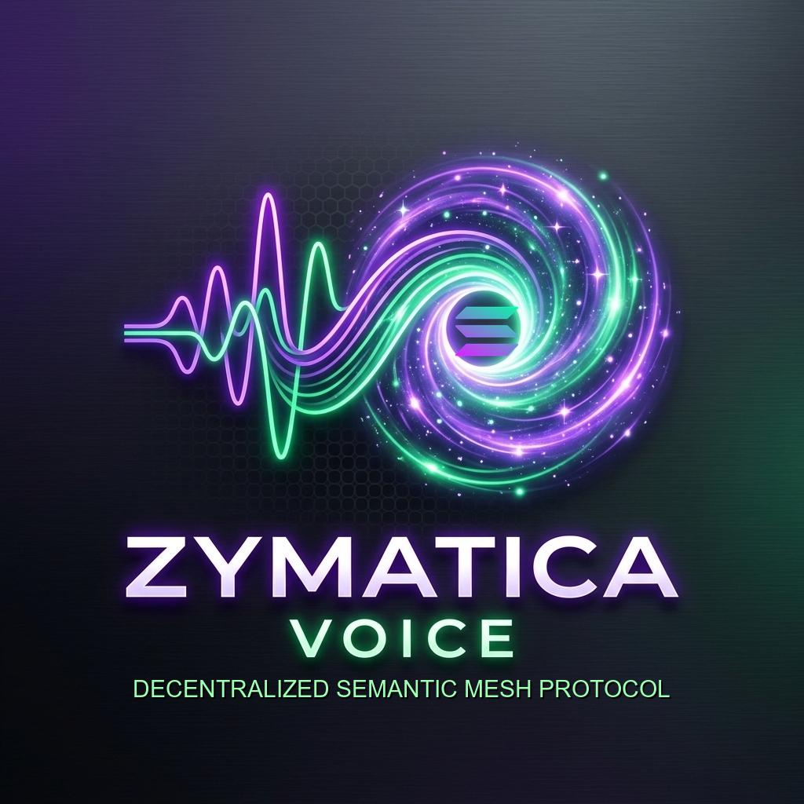

# Zymatica: Solana Cuneiform Anchor — Milestone 1 ✅

> **Solana Devnet Program ID:** `2is5Q4rPBpZa2RUCXP7FFdHJUYSVNcW5iTxNuf5mSccy`  
> **Treasury Wallet:** `CotbUcSMqaqn69YSmh2YgYZjKfE7cZk4fTsEmE3kfWJ`  
> **Status: COMPLETE** | **License: Conditional Open-Source Grant License**



This repository contains the standalone codebase and deliverables for **Milestone 1** of the Solana Foundation USA Grant.

---

## 🎯 Milestone 1 Deliverables
*   **On-Chain Semantic coordinate Registry:** Anchor smart contract allowing nodes to register Cuneiform-U coordinate concepts on-chain.
*   **Automatic Fee Collection:** CPI-based transfer of 100,000 lamports per registration to the treasury cold wallet.
*   **TypeScript client SDK:** Developer library containing the CuneiformClient wrapper for program integration.
*   **Integration Tests:** 11/11 tests passing on devnet.

---

## 📂 Repository File Structure

*   `programs/solana-cuneiform-anchor/` — Rust smart contract source code.
*   `app/src/cuneiform_client.ts` — TypeScript SDK.
*   `app/src/test_devnet.ts` — Live devnet integration test suite.
*   `app/src/deploy_devnet.ts` — Contract state initialization script.
*   `milestones/milestone-1-devnet-deployment/` — Compiled program `.so` and documentation.
*   `Logo_Zymatica_Voice.png` / `Logo.jpg` — Brand assets.

---

## 🚀 How to Verify (Evaluator Instructions)

### 1. View on Solana Explorer
Visit: [Solana Explorer Address](https://explorer.solana.com/address/2is5Q4rPBpZa2RUCXP7FFdHJUYSVNcW5iTxNuf5mSccy?cluster=devnet)

### 2. Run Integration Tests Locally
```bash
# Install dependencies
npm install

# Run the test suite
npx tsx app/src/test_devnet.ts
```

---
---

## 📜 License

**Conditional Open-Source Grant License**

This project is currently under a proprietary license during the grant evaluation period. It will automatically transition to the open-source **Apache License 2.0** upon the approval and funding of the Superteam USA / Solana Foundation grant.

Please see the [LICENSE](./LICENSE) file for the full terms and conditions.
